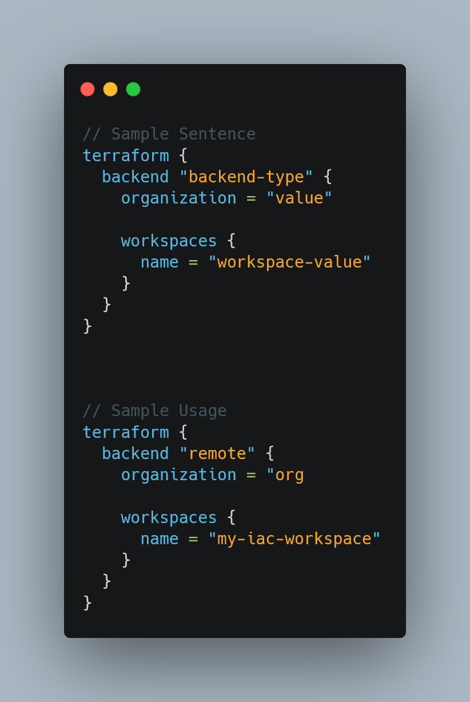

# Core Concepts

Owner: Khant Naing Set (WhateverOps)
Tags: IaC, Terraform

## **What is IAC**

- Define infrastructure in Code (Obviously!!!)

## **Declarative vs Imperative**

| Declarative | Imperative |
| --- | --- |
| Achieve the goal by declaring with attributes | Achieve the goal by doing steps by steps |
- Add variable in Terraform plan stage: `terraform plan -var ‘variable_name=value’`

**Terraform is Declarative!!!**

## **Idempotent and Consistency**

- Terraform will not change already if something is already fulfilled the desired state

## **Pull or Push**

- Terraform is agentless and push the configuration to target or pull the data from the target,

## **Benefits of IAC**

- Automated deployment
- Reduce time and complexity in repeatable processes
- Consistent environments
- Reusability (DRY)
- Self documented the architecture
- Reduce human error in manual process

## **Facts of Terraform**

- Open-source and vendor agnostic
- Single binary compiled from Go
- Declarative syntax
- Better use HCL (recommended and most used)
- State based (State file is the key)
- Plugins based: Highly depends on plugins

## Terraform Workflow


### Init

Terraform usually work with plugins for specific provider like AWS, or GCP, in order to initialize the plugins the following command has to use

```bash
terraform init
```

`terraform init` command check the configuration file inside the directory, and then if the current config need plugins, it will download the plugins from the sources(terraform registry or alternative sources). Also this command initialize the **backend** and **state** if they are not already existed in the current working directory.

### Plan

Terraform plan can be execute with the following command

```bash
terraform plan
```

In `terraform plan` terraform check the state data and current code to made the plan for the deployment. 

If you want to store the plan inside a file try the following

```bash
terraform plan -out plans.tfplan
```

The above command will save the terraform plan inside a `.tfplan` file.

### Apply

After the planning, executing the following command will deploy the actual infrastructure on the cloud provider.

```bash
terraform apply
```

Apply with the file

```bash
terraform apply "plans.tfplan"
```

**Note:  if you want to destroyed everything, execute the following command to destroyed everything that is deployed by terraform**

```bash
terraform destroy
```

## **Terraform Object Types**

- Provider: Cloud Provider like AWS, GCP or Azure
- Resources: resource form associated providers cloud like EC2 Instances, Database, VPC, etc……
- Data sources: Query information's from associated  providers like list of AMI from EC2, available regions, etc….

## **Terraform HCL Syntax**

- Block syntax: Terraform use block syntax for everything from providers to data sources. Each block start with type and then label and name label. Inside the block everything is key values or nested block. Nested block only support block type.
- **Sample Structure:**


- **Sample Code**:


- Sample Terraform Object Reference:

- **How to reference terraform resources:**


## Terraform Input Variables and Outputs


- **Input variables** are value input by the external.
- **Local values** are values inside terraform config. Local cannot be input by external, they are just local inside terraform config.
- Data return by terraform is **Output values**

### Input Variable

- **Variable can be defined with following basic sentences:**


- **Example usages:**


- Terraform Variable Reference


  

## Terraform Input Variable Data Types

Data Types can be divided into three group

- **Primitive**: String, number, Boolean
- **Collection**: List. set. map
    - **Collection** is basically a collection of **Primitive** data types. **(Data types in collection must be the same!!!)**
    - **Example**:
    
    
    

- **Structural**: Tuple, object

**Note**: Input Variables can be input from external via command line or `.tfvars` file otherwise it will use default value, but if the default value isn’t provide it will ask to provide value in command line.

### Locals

- Unlike variables locals only reside in terraform config, they cannot be input by external.
- **Locals sample:**


**Note: Each key inside each locals must be unique**

### Output

**Outputs** are the way to get data from the terraform to external. But necessary output from terraform will not show magically, so we need to define output for the value we want in external.

- **Outputs** are like **variables**, it define with same structure as variable
- **Sample syntax:**


- **Sample usage:**


## Terraform State

Managed infrastructure and configuration must be stored in Terraform.
Terraform makes use of this state to coordinate real-world resources with your configuration, manage metadata, and boost speed for sizable infrastructures. Terraform used to state to create plans and make change to infrastructure. The primary purpose of Terraform state is to store bindings between objects in a remote system and resource instances declared in your configuration. When Terraform creates a remote object in response to a change of configuration, it will record the identity of that remote object against a particular resource instance, and then potentially update or delete that object in response to future configuration changes.

- This state can be remotely stored, which works better in a collaborative setting, although it is typically stored locally in a file called `terraform.tfstate`
- State are stores in terraform backend
- State files are typically in JSON format, but editing them is highly taboo.
- Terraform states are backward compatible.
- CLI command to show state

```bash
terraform state show
```

- CLI command for programmatic consumption

```bash
terraform show -json
```

## Terraform Workspaces

Workspaces in the Terraform CLI refer to separate instances of state data inside the same Terraform working directory. We can work without defining workspace for sure but if we’re working with team of too many cloud providers, or multiples environment like: `dev, prod, test,` etc…. Workspaces are necessary. By default, terraform use `default` workspace.

- Define new workspace

```bash
terraform workspace new 'new-workspace-name'
```

- List all workspaces inside current machine

```bash
terraform workspace list
```

- Select the desire workspace

```bash
terraform workspace select 'workspace-name'
```

- Delete work space

```bash
terraform workspace delete 'workspace-name'
```

- Workspaces are not to design to solve all of the problems and they can get complex for small scale deployment, so use wisely.
- Workspaces are not suitable in system decomposition.

## Terraform Backend

- Terraform uses persisted state data to keep track of the resources it manages and the store location of that state data file is called backend.
- They are multiple options for backend. Terraform used `local` for it default backend
- List of available backends
    - local
    - remote
    - AzureRM
    - consul
    - cos
    - gcs
    - http
    - Kubernetes
    - oss
    - pg
    - s3
- Sample sentence for terraform backend



- **A configuration can only provide one backend block.**
- **A backend block cannot refer to named values (like input variables, locals, or data source attributes).**
- Backend is initialize at `terraform init`

# Terraform Provisioners

- Provisioners can be use to perform actions on the local machine or remote machine.
- Provisioners is typically configuration management of Terraform.
- Provisioners are last resort and not a recommended way of handling things
- Terraform includes the concept of provisioners as a measure of pragmatism, knowing that there are always certain behaviors that cannot be directly represented in Terraform' s declarative model.
- Hashicorp’s recommended to use other approach instead, example; Cloud Init, user_data, Ansible, etc….
- Two types of Provisioners
    - File
        - File copying operation provisioner
        
        ```hcl
        # Copies the configs.d folder to /etc/configs.d
          provisioner "file" {
            source      = "conf/configs.d"
            destination = "/etc"
          }
        ```
        
    - local-exec
        - Run on local machine
        
        ```hcl
        resource "aws_instance" "web" {
          # ...
        
          provisioner "local-exec" {
            command = "echo ${self.private_ip} >> private_ips.txt"
          }
        }
        
        # With Interpreter
        resource "terraform_data" "example1" {
          provisioner "local-exec" {
            command = "open WFH, '>completed.txt' and print WFH scalar localtime"
            interpreter = ["perl", "-e"]
          }
        }
        ```
        
    - remote-exec
        - Run on remote machine or Terraform resource
        
        ```hcl
        resource "aws_instance" "web" {
          # ...
        
          # Establishes connection to be used by all
          # generic remote provisioners (i.e. file/remote-exec)
          connection {
            type     = "ssh"
            user     = "root"
            password = var.root_password
            host     = self.public_ip
          }
        
          provisioner "remote-exec" {
            inline = [
              "puppet apply",
              "consul join ${aws_instance.web.private_ip}",
            ]
          }
        }
        
        # Script Arguments
        resource "aws_instance" "web" {
          # ...
        
          provisioner "file" {
            source      = "script.sh"
            destination = "/tmp/script.sh"
          }
        
          provisioner "remote-exec" {
            inline = [
              "chmod +x /tmp/script.sh",
              "/tmp/script.sh args",
            ]
          }
        }
        ```
        

## Sentinel

- Policy as a Code
- Integrate in HasihCorp enterprise product

## Personal Notes

- Even through concepts like backends and state are advance, they don’t have too many characteristic, if the user know terraform sentence and workflow they can easily configured and use.
- If the deployment is big, better to break down into small module and reuse in main module. Resources in following link [https://www.freecodecamp.org/news/terraform-modules-explained/](https://www.freecodecamp.org/news/terraform-modules-explained/)
- Create workspace for each terraform project.
- Use vault or other secrets management services for sensitive data
- Better to use remote backend than `local`.
- Terragrunt is the best too for managing terraform state, backend and modules.
- Always use variable for values.
- Use `tfvars` for values storage
- Run `terraform plan` before `terraform apply` every time.
- Better to store `terraform plan` in file.

# Exam Cautious Facts!!!

- Use terraform show to view the contents of the state file.
- In production environment, it is always recommended to hardcode the provider version.
- Input variables are asked to input in even at the `terraform plan` stage.
- Terraform apply does not validate the terraform configuration syntax.
- Provisioner are executed only at creation and destruction, not during updating. It doesn’t work on existing instances.
- **Sentinel Policy is applied after `terraform plan`**
- Benefits of policy as a code in Terraform
    - Sandboxing
    - Automation
    - Codification
    - Version Control
    - Testing
- If something is manually configured, Terraform will ignore it, since it’s not a part of Terraform state.
- `terraform init` required only in the situations of backend adding or removing.
- Default concurrent operations = 10
    - Usage:
    
    ```bash
    # Can be also used for limiting the concurrent operations
    terraform apply -parallelism=n
    ```
    
- Terraform provider is for API interactions and resources for clouds, not a plugin.
- In remote-exec, only SSH and `winrm` are supported.
- In CLI login, only API token work.
- There is no terraform command called inspect.
- Community providers can also be downloaded by using `terraform init`
- PostgreSQL is the backend in Terraform cloud.
- Terraform enterprise exclusive features
    - SSO
    - Audit Logging
    - Private Networking
    - Job Scaling
    - Service Now Integration
    - Higher level of support
- Artifactory does not support state locking
- TF_VAR_ for setting env variables
- If the provisioner failed, terraform will error, resource will be tainted and rerun the provisioners again on the next apply.
- `terraform fmt -check` is for checking the canonical format is applied or not.
- Terraform import update the state file, it will not generate the code.
- If the resource local name is change it also need to change inside the state file too using `terraform state mv <resource.old_variable_name> <resource.new_variable_name>`
- Public registry import: `source /`
- Public module doesn’t need module version
- `terraform fmt` indent space is 2
- Way to skip interaction in `terraform apply`
    
    ```bash
    # 1
    terraform apply -auto-approve
    
    #2
    terraform plan -out='plan.tfplan' && terraform apply plan.tfplan
    ```
    
- `terraform apply -destroy` can also used for destroying the resources.
- Force unlock is unlock with lock id, not a state file.
- Remote backend that support default locking
    - azurerm
    - gcs
- Way to show terraform outputs
    
    ```bash
    #1
    terraform output
    
    #2
    terraform show
    
    #3
    terraform output -state=terraform.tfstate
    ```
    
- Terraform has no direct integration with Vault till now.
- Data sources can be given by anyone
- `depends_on` is explicit dependency